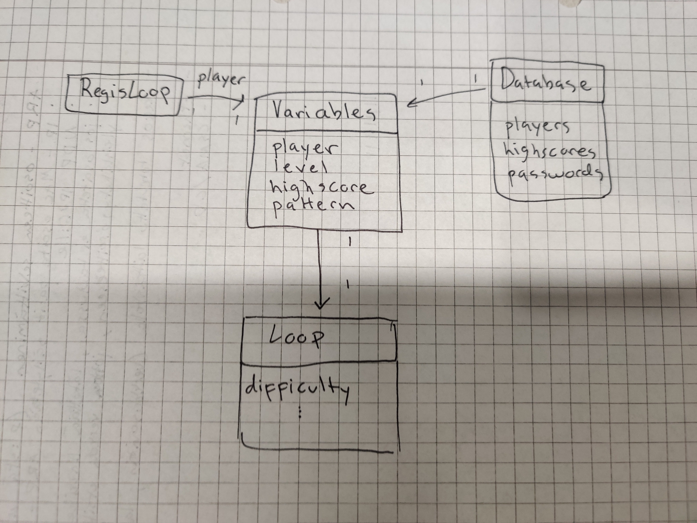

# Arkkitehtuurikuvaus

## Rakenne

Ohjelman rakenne koostuu viidestä eri pakkauksesta: ui, loops, logic, objects ja database.

Ui pakkauksesta löytyy kaikki graafiseen käyttöliittymään kuuluvat luokat. Loops pakkauksessa olevat luokat pyörittävät ohjelmaa ja reagoivat käyttäjän toimintoihin. Logic pakkauksessa löytyy pelin logiikkaa hallinnoivia luokkia. Objects pakkauksessa olevat luokat alustaa objekteja. Database pakkauksessa oleva luokka suorittaa tietokantaan liittyviä toimintoja.

## Toiminnallisuuksia

### Sisäänkirjautuminen

Oheisessa sekvenssikaaviossa oletuksena on, että tietokannasta on löytynyt aiemmin syötetty käyttäjänimi "Testi", käyttäjä on syöttänyt käyttäjänimeen yhteensopivan salasanan "testi123" ja painanut käyttöliittymän "enter" painiketta.

### Käyttäjän luonti

Oheisessa sekvenssikaaviossa oletuksena on, että käyttäjä on jo syöttänyt uuden käyttäjänimen "Testi", jota ei löydy vielä tietokannasta. Sitten käyttäjä on syöttänyt salasanan "testi123" ja painanut käyttöliittymän "enter" painiketta.

## Pelin sovelluslogiikka

Kun pelaaja on kirjautunut onnistuneesti sisään, RegisLoop palauttaa pelaajan käyttäjänimen, joka annetaan variables luokan oliolle attribuutiksi. Variables noutaa tähän pelaajaan liittyvät tiedot tietokannasta tietokantaa käsittelevän luokan Database kautta. Peliä pyörittävä Loop saa attribuutikseen tämän variables olion, jolloin esimerkiksi pelin aikana tapahtuvat muutokset (highscoren muutos) tallettuvat ensin variables oliossa ja myöhemmin tietokantaan.

## Tietojen pysyväistallennus

Paikallisten käyttäjien käyttäjänimet, salatut salasanat sekä paras tulos talletetaan paikallisesti luotuun SQLite-tietokantaan, player_database.db. Tätä tietokantaa käsittelee pakkauksen database luokka Database. 

## Rakenteen heikkouksia

Rakenne on hieman sekava. Esimerkiksi loops pakkauksessa olevat luokat ovat vastuussa usea asioista, eli tehtäviä ei ole jaettu yksi / luokka.
Lisäksi tietokannan sovelluksessa ei ole käytetty ympäristömuuttujia (eivät toimineet).
