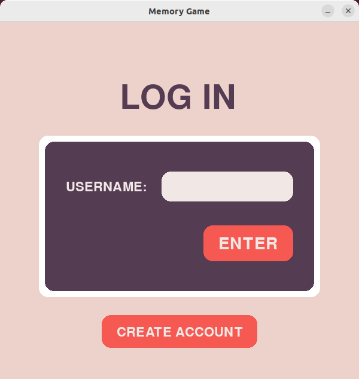
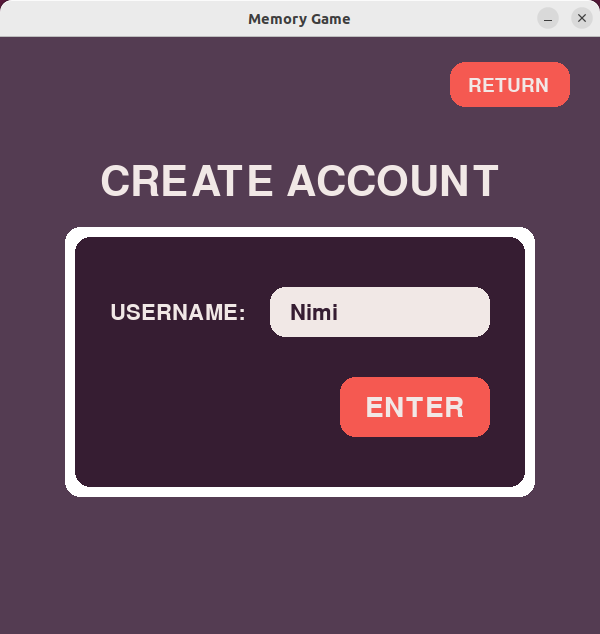
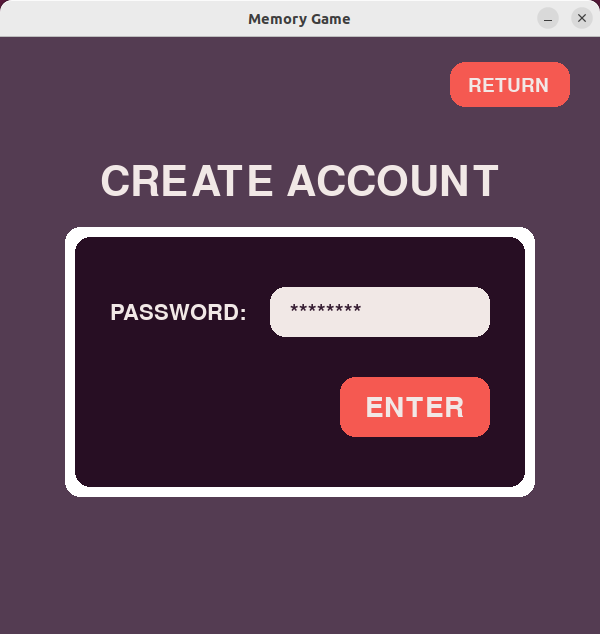

# Käyttöohje

## Pelin käynnistys

Siirry pelin juurihakemistoon komennolla:
```
cd memory_game
```
Pelin riippuvuudet voit asentaa komennolla:
```
poetry install
```
Kun riippuvuudet on asennettu, voit käynnistää pelin komennolla:
```
poetry run invoke start
```

## Käyttäjän luominen

Jos sinulla on jo käyttäjätili, voit siirtyä seuraavaan vaiheeseen "sisäänkirjautuminen".



Kun ohjelma käynnistyy, avautuneesta näkymästä voi siirtyä luomaan uuden käyttäjän painamalla "CREATE ACCOUNT" painiketta.



Avautuu uusi näkymä, jossa voi syöttää uuden käyttäjätunnuksen. Painamalla "ENTER" painiketta tai näppäintä voi siirtyä luomaan salasanaa.



Uuden salasanan syöttämisen jälkeen, painamalla uudelleen "ENTER" painiketta tai näppäintä uusi käyttäjätunnus luodaan. Näkymä vaihtuu takaisin kirjautumisnäkymään. Tietoturva syistä syötäthän salasanan, jota et jo käytä missään muualla.

## Sisäänkirjautuminen

Olemassa olevalle käyttäjälle voi kirjautua syöttämällä ensin käyttätunnuksen ja painamalla "ENTER" painiketta tai näppäintä, ja sitten syöttämällä salasanan ja painamalla uudelleen "ENTER".

## Vaikeustason valinta

Onnistuneen sisäänkirjautumisen jälkeen avautuu asetusnäkymä. Tästä näkymästä painamalla "EASY", "MEDIUM" tai "HARD" painiketta ja sitten "ENTER" painiketta voi valita vaikeustason ja aloittaa pelin.

## Muistipelin pelaaminen

Peli väläyttää ensin yhtä ruutua vihreänä. Tämän jälkeen klikkaamalla samaa ruutua pääsee seuraavalle kierrokselle, jolloin vihreitä välähdyksiä on yksi enemmän. Seuraa väläytys sarjaa, paina se mieleesi ja toista se, kun koko sarja on näytetty. Väärän ruudun klikkauksesta häviää pelin. Pelin voi aloittaa alusta häviön jälkeen painamalla "TRY AGAIN" painiketta "Game Over" näkymässä.

## Tulostaulun tarkastelu

Pelin hävittyä avautuvasta "Game Over" näkymästä pääsee tulostaulu näkymään painamalla "SCOREBOARD" painiketta.
