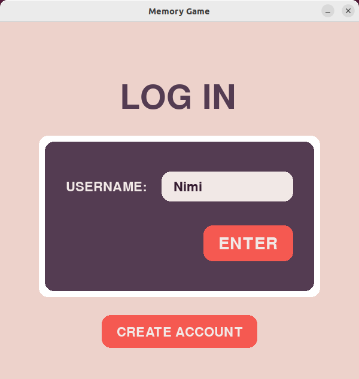
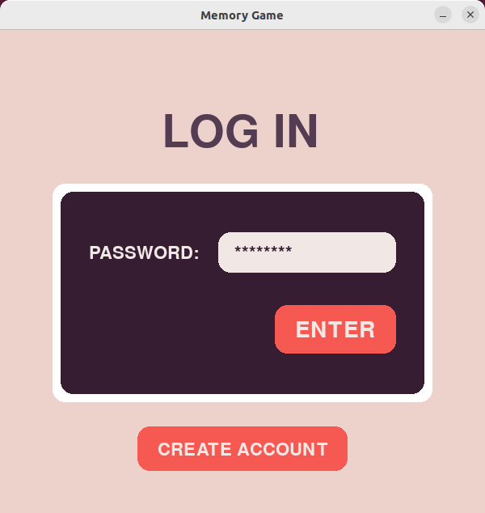
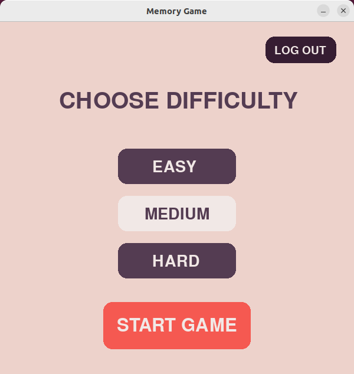
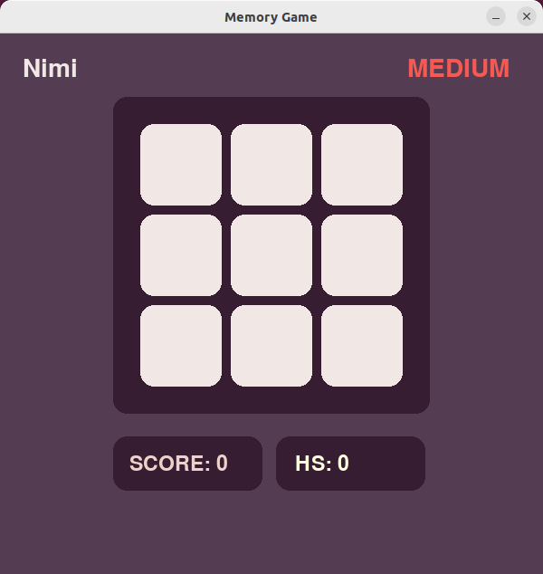
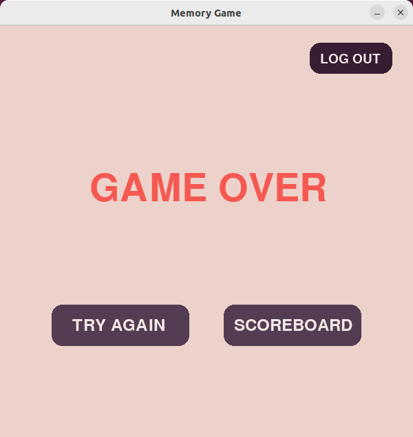
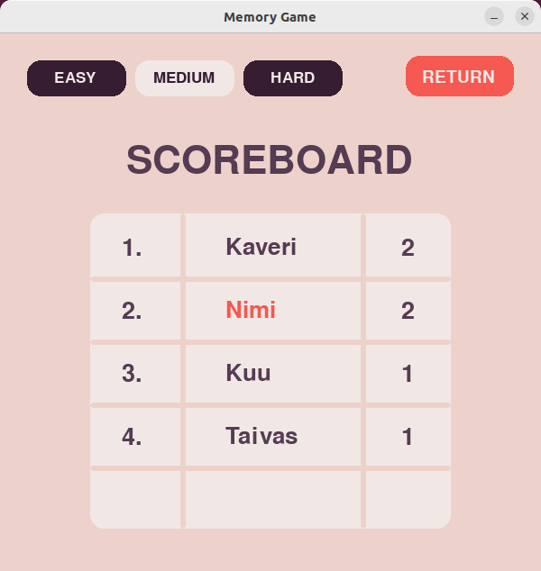

# Käyttöohje

## Pelin käynnistys

Siirry pelin juurihakemistoon komennolla:
```
cd memory_game
```
Pelin riippuvuudet voit asentaa komennolla:
```
poetry install
```
Kun riippuvuudet on asennettu, voit käynnistää pelin komennolla:
```
poetry run invoke start
```

## Käyttäjän luominen

Jos sinulla on jo käyttäjätili, voit siirtyä seuraavaan vaiheeseen "sisäänkirjautuminen".


Kun ohjelma käynnistyy, avautuneesta näkymästä voi siirtyä luomaan uuden käyttäjän painamalla "CREATE ACCOUNT" painiketta.


Avautuu uusi näkymä, jossa voi syöttää uuden käyttäjätunnuksen. Painamalla "ENTER" painiketta tai näppäintä voi siirtyä luomaan salasanaa.


Uuden salasanan syöttämisen jälkeen, painamalla uudelleen "ENTER" painiketta tai näppäintä uusi käyttäjätunnus luodaan. Näkymä vaihtuu takaisin kirjautumisnäkymään. Tietoturva syistä syötäthän salasanan, jota et jo käytä missään muualla.

## Sisäänkirjautuminen

Olemassa olevalle käyttäjälle voi kirjautua syöttämällä ensin käyttätunnuksen ja painamalla "ENTER" painiketta tai näppäintä, ja sitten syöttämällä salasanan ja painamalla uudelleen "ENTER" painiketta tai näppäintä.





## Vaikeustason valinta

Onnistuneen sisäänkirjautumisen jälkeen avautuu asetusnäkymä. Tästä näkymästä painamalla "EASY", "MEDIUM" tai "HARD" painiketta ja sitten "START GAME" painiketta voi valita vaikeustason ja aloittaa pelin.
Vaikeustaso vaikuttaa pelissä näytettävän painallussarjan näyttönopeuteen sekä siihen, montako uutta painallusta tulee aina lisää uudella kierroksella.



## Muistipelin pelaaminen

1) Peli näyttää ruutujen painallussarjan väläyttämällä ruutuja vuorollaan vihreällä. Paina järjestys mieleesi.
2) Kun ruudulla välähtää teksti "YOUR TURN!", sarja on näytetty kokonaan.
3) Toista sarja klikkaamalla hiirellä ruutuja aiemmin näytetyssä järjestyksessä. Väärästä klikkauksesta häviää pelin.
4) Jos koko sarjan onnistuu toistamaan oikein ruudulla välähtää teksti "CORRECT!", jonka jälkeen alkaa uusi kierros. Uudella kierroksella kaikki yllämainitut asiat toistuvat, mutta sarja on pidempi.



Pelin alareunassa oleva SCORE kertoo, monennellako kierroksella olet ja HIGHSCORE ennätyksesi tällä vaikeustasolla.

# Game Over näkymä

Pelin häviämisen jälkeen aukeaa Game Over-näkymä. Painamalla "TRY AGAIN" painiketta, peliä voi pelata uudelleen. "SCOREBOARD" painikkeesta pääsee tulostaulunäkymään.



## Tulostaulun tarkastelu

Tulostaulunäkymän avautuessa ruudulla on "EASY" vaikeustason tulostaulu. Eri vaikeustason tulostaulua voi katsoa painamalla yläreunan vaikeustasoa vastaavaa painiketta.


